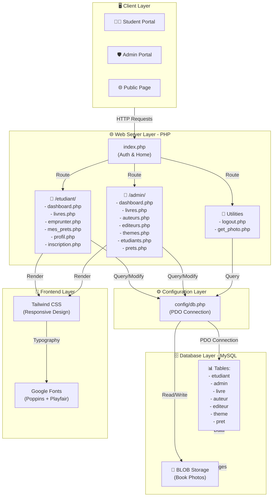
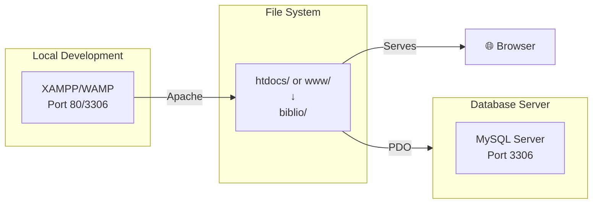

# 📐 Architecture Overview - Prestige Library

## System Architecture



---

## System Components

### 1. **Client Layer** 👥
- **Student Portal**: Access catalogue, borrow books, view history
- **Admin Portal**: Manage books, users, authors, publishers, loans
- **Public Page**: Home page and authentication

### 2. **Web Application Layer** 🌐
#### Authentication & Routing
- `index.php` - Entry point, handles login/logout redirection
- `logout.php` - Session termination

#### Student Module (`/etudiant/`)
| Component | Purpose |
|-----------|---------|
| `dashboard.php` | Student profile & active loans |
| `livres.php` | Book catalogue with search functionality |
| `emprunter.php` | Loan processing logic |
| `mes_prets.php` | Borrow history |
| `profil.php` | Profile management |
| `inscription.php` | User registration |

#### Admin Module (`/admin/`)
| Component | Purpose |
|-----------|---------|
| `dashboard.php` | Admin overview & statistics |
| `livres.php` | Book CRUD + photo upload |
| `auteurs.php` | Author management |
| `editeurs.php` | Publisher management |
| `themes.php` | Category/Theme management |
| `etudiants.php` | User account management |
| `prets.php` | Loan administration |

#### Utilities
- `get_photo.php` - Retrieves book images from BLOB storage

### 3. **Configuration Layer** ⚙️
- `config/db.php` - PDO database connection
  - Configurable host, database name, credentials
  - Centralized connection management

### 4. **Database Layer** 🗄️
#### Data Tables
| Table | Purpose |
|-------|---------|
| `etudiant` | Student/member records |
| `admin` | Administrator accounts |
| `livre` | Book catalogue |
| `auteur` | Author information |
| `editeur` | Publisher information |
| `theme` | Book categories |
| `pret` | Loan transaction records |

#### Storage
- **BLOB Storage**: Book cover images stored in database

### 5. **Frontend Layer** 🎨
- **Tailwind CSS**: Responsive, modern UI design
- **Google Fonts**: Custom typography (Poppins + Playfair Display)

---

## Data Flow

### Student Borrow Flow
```
Student Portal → Login (index.php) 
→ Browse Books (livres.php) 
→ Search/Filter 
→ Select Book 
→ Request Borrow (emprunter.php) 
→ Insert into pret table 
→ Update Display
```

### Admin Management Flow
```
Admin Portal → Login (index.php) 
→ Admin Dashboard (admin/dashboard.php) 
→ Select Entity (Books/Authors/etc) 
→ CRUD Operations 
→ Database Update 
→ Confirmation
```

---

## Security Architecture

### Authentication & Authorization
- **Password Security**: Passwords hashed with `password_hash()`, verified with `password_verify()`
- **SQL Injection Prevention**: PDO prepared statements on all queries
- **Server-Side Validation**: All form inputs validated before processing
- **Session Management**: URL-based ID navigation (explicit state handling)

### Data Protection
- **Database Access**: Centralized through `config/db.php`
- **Prepared Statements**: All database queries use parameterized queries
- **User Roles**: Separate routing for students and admins
- **Default Credentials**: Must be changed on first login (admin/password)

---

## Technology Stack

| Layer | Technology | Version |
|-------|-----------|---------|
| **Runtime** | PHP | 8.0+ |
| **Database** | MySQL | Any recent |
| **ORM/Driver** | PDO | Built-in |
| **Styling** | Tailwind CSS | Latest |
| **Fonts** | Google Fonts | Latest |
| **Server** | Apache/XAMPP/WAMP | - |

---

## Deployment Architecture



**Deployment Steps:**
1. Place `biblio/` folder in `htdocs` (XAMPP) or `www` (WAMP)
2. Create database: `biblio_db`
3. Import schema and default data
4. Configure `config/db.php`
5. Access via `http://localhost/biblio/index.php`

---

## Future Enhancement Opportunities

- 🔄 Implement RESTful API endpoints
- 📱 Create mobile application
- 🔐 Add 2FA authentication
- 📊 Advanced reporting & analytics dashboard
- 🔔 Email notifications for overdue books
- 🔍 Full-text search capabilities
- 📦 Book reservation system
- ♻️ Automatic fine calculation for late returns

